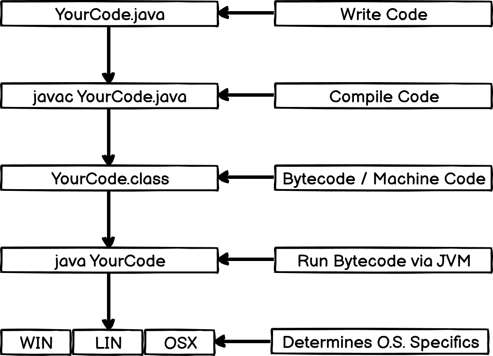
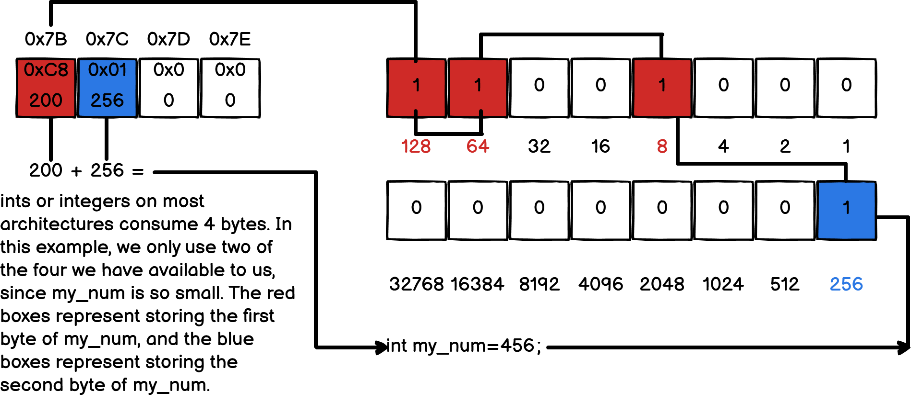

<div align="center">
	
	<h1>Week 1 Day 1 - Intro To Java</h1>
</div>

## Topics / Concepts:

* Compiled vs Intepreted

* Static Types vs Dynamic Types

* Naming Conventions

* Types, Conditionals, Loops, and Operators

* Casting

* Imports & Packages

* Static Arrays, Dynamic Arrays

* Hashmaps

## Why Java?

* Compiled Language
* Write One Run Anywhere
* Enormous Standard Library
* Object Oriented
* Widely Used

## How Java Works - Java Virtual Machine (J.V.M.)

TL;DR Translates code into a machine and O.S. independant executable.

The java virtual machine (JVM) lets us write code once and use that same code on any machine or operating system. The reason this is possible is because of JVM and an intermediate form of binary called bytecode upon compilation of a Java program. At this stage, we could take the resulting .class files / bytecode, and hand it off to Java / JVM on any machine or operating system and it would translate those same instructions to that machine's specific architecture. This means that the developers of Java and the JVM had to write code that would function on each operating system the same way the user intended without side effects. This means we don't have to learn how to write code for Windows, Linux, OSX, or any other platforms we intend our software to run on. Before Java, we would've had to write 3 separate programs each targeting the aforementioned platforms. With Java, we write that code once.

<div align="center">
	
</div>

## Compiled VS Interpreted:

### Interpreted:

TL;DR Your code requires a host language in order to run.

Interpreted languages are languages that DO NOT compile code to machine code. They instead are programs themselves (Likely written in ASM, C, C++, Rust) that operate on source code as input. E.G. They require a host language to operate (Like parasites). The interpreter first performs lexical analysis which is the act of breaking up the source code input into "tokens" that represent keywords or actions to be processed by the parser in the next step. After lexing, the parse phase begins. This is where the source code is checked for grammatical problems and errors, and that it conforms to the language's rules. During parsing, the source code is also organized into a tree structure, typically referred to as an abstract syntax tree (A.S.T). After parsing, the interpreter has gathered enough information to execute the code it generated into the AST. The AST is then walked / travered / iterated, and the code is executed.

### Compiled:

TL;DR Your code must be compiled to machine code or close to it before it can run.

Compiled languages are languages that DO compile code to machine code, or come close to it. ( Bytecode in Java's case ). This means there is an additional compilation step performed before the program can even execute or run. Compilation also involves lexical analysis and parsing, but is much more strict, since it must be converted to machine code (Not necessarily binary 1s and 0s). The compiler must be able to read each line of code and substitute what it believes to be the most optimal CPU instruction opcode equivalent. An opcode is a hexadecimal number that corresponds to an operation that the CPU must perform, such as the SUB instruction which corresponds to the hexadecimal value 0x28 on intel x86 processors. It must do this subsitution for all code written. After this compilation process, we can finally execute the raw machine code (or byte code via JVM in Java's case) as an executable process.

## Static Types vs Dynamic Types - Variables

TL;DR We must specify data types when creating variables, functions, etc.

Most if not all compiled languages are statically typed. This means that when we create variables, functions, pass parameters to those functions, return from functions, etc, we must specify the exact type of data we are operating on, whether it be an integer, string, character, decimal, array, etc. This may seem like a monotonous waste of time coming from a dynamically typed language. However, it gives us much more control over RAM and how much space we are consuming and how much we actually require. It also gives us much more control over that data, as we can expect it to be in a specific format before operating on it. Supplying types to variables informs the compiler precisely how much space or RAM it must reserve and allocate to store data. In dynamically typed languages, this is left to the interpreter, therefore we cannot guarantee how much space will be consumed, and it may consume more than we need.

### Javascript:

```js
var age = 30;
var grade = 'B';
var name = "Bobert";
```

### Python:

```python
age = 30
grade = 'B'
name = "Bobert"
```

### Java:

```java
public class Program
{
	public static void main(String[] args)
	{
		int age = 30; /* 4 bytes on most machines. */
		char grade = 'B'; /* 1 byte on most machines. */
		String name = "Bobert"; /* 6 bytes */
	}
};
```

### Memory allocation in a nutshell:

<div align="center">
	
</div>

## Naming Conventions

Java programs use the ```PascalCase``` naming convention for classes as a standard. This means the first letter of each word including the first word is uppercase.

PascalCase Examples:

* ```UserController```
* ```CategoryProduct```
* ```CrudRepository```
* ```CommentService```

For variable, member, method, or function names, ```camelCase``` is typically preferred. This means the first letter of the first word is lowercase, and every other word's first letter is uppercase.

camelCase Examples:

* ```myNum = 123```
* ```userService.getById(10);```
* ```groceryList.add(new Grocery("Milk"));```

## Primitive Types:

* char - 1 byte, 8 bits, integer - 0-255
* short - 2 byte, 16 bits, integer 0-65535
* int - 4 byte, 32 bits, integer 0-4294967296
* long - 8 byte, 64 bits, integer 0-9223372036854775807
* float - 4 byte, 32 bits, decimal
* double - 8 byte, 64 bits, decimal
* boolean - 1 byte, 8 bits, true / false

## Useful Resources:

https://godbolt.org/

https://javap.yawk.at

http://ref.x86asm.net/coder64.html#x0F90

https://www.asciitable.com/

## End Of Day: Cafe Java
